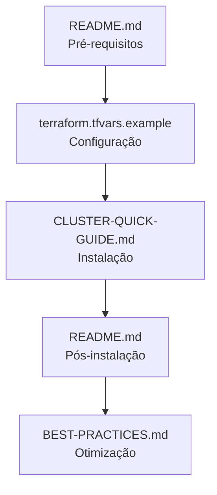
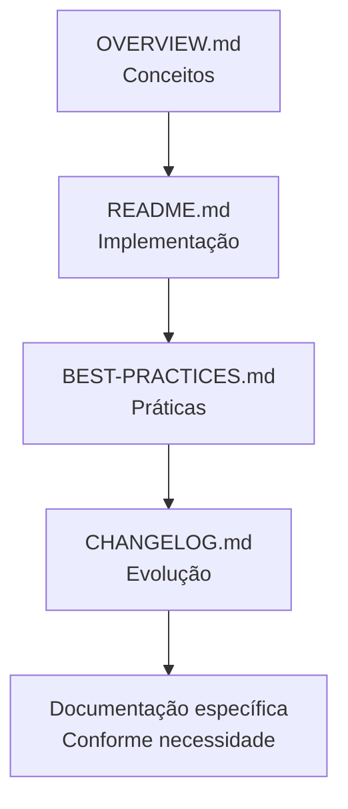
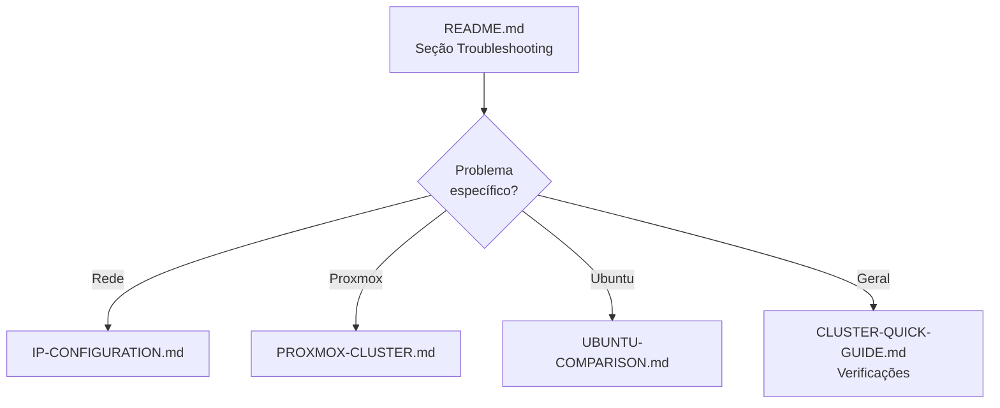

# 📚 Índice da Documentação

> **Guia completo de navegação pelos documentos do projeto Kubernetes + Proxmox VE + Rancher**

## 🎯 **Por Onde Começar?**

### 👋 **Primeiro Acesso**
1. **[README.md](README.md)** - 📖 **COMECE AQUI** - Documentação principal
2. **[CLUSTER-QUICK-GUIDE.md](CLUSTER-QUICK-GUIDE.md)** - ⚡ Deploy rápido em 15 minutos
3. **[terraform.tfvars.example](terraform.tfvars.example)** - 📝 Template de configuração

### 🔧 **Implementação**
1. **Preparar ambiente** (README.md - Pré-requisitos)
2. **Configurar variáveis** (terraform.tfvars)
3. **Executar instalação** (`make install`)
4. **Verificar resultado** (`make validate`)

---

## 📁 **Documentação por Categoria**

### 🚀 **Instalação e Uso**
| Arquivo | Descrição | Público-Alvo |
|---------|-----------|--------------|
| **[README.md](README.md)** | Documentação principal completa | Todos os usuários |
| **[CLUSTER-QUICK-GUIDE.md](CLUSTER-QUICK-GUIDE.md)** | Guia de instalação expressa | Usuários experientes |
| **[terraform.tfvars.example](terraform.tfvars.example)** | Template de configuração | Todos os usuários |

### 🏗️ **Arquitetura e Conceitos**
| Arquivo | Descrição | Público-Alvo |
|---------|-----------|--------------|
| **[OVERVIEW.md](OVERVIEW.md)** | Visão geral e arquitetura | Arquitetos, líderes técnicos |
| **[BEST-PRACTICES.md](BEST-PRACTICES.md)** | Melhores práticas implementadas | DevOps, engenheiros |

### 📊 **Histórico e Evolução**
| Arquivo | Descrição | Público-Alvo |
|---------|-----------|--------------|
| **[CHANGELOG.md](CHANGELOG.md)** | Histórico de mudanças | Mantenedores, usuários avançados |
| **[MIGRATION-SUMMARY.md](MIGRATION-SUMMARY.md)** | Resumo de migrações | Usuários existentes |

### 🔧 **Configuração e Troubleshooting**
| Arquivo | Descrição | Público-Alvo |
|---------|-----------|--------------|
| **[IP-CONFIGURATION.md](IP-CONFIGURATION.md)** | Configuração de rede | Administradores de rede |
| **[PROXMOX-CLUSTER.md](PROXMOX-CLUSTER.md)** | Configuração Proxmox específica | Administradores Proxmox |
| **[UBUNTU-COMPARISON.md](UBUNTU-COMPARISON.md)** | Comparação Ubuntu 22.04 vs 24.04 | Administradores de sistema |

### 📋 **Documentação Adicional**
| Arquivo | Descrição | Público-Alvo |
|---------|-----------|--------------|
| **[DOCUMENTATION-REVIEW.md](DOCUMENTATION-REVIEW.md)** | Review da documentação | Redatores técnicos |
| **[SENSITIVE-INFO-CLEANUP.md](SENSITIVE-INFO-CLEANUP.md)** | Limpeza de informações sensíveis | Equipe de segurança |

---

## 🎭 **Documentação por Persona**

### 👨‍💼 **Gestor/Arquiteto de TI**
**Objetivo**: Entender o projeto e viabilidade
```
1. OVERVIEW.md - Visão geral e benefícios
2. README.md (seção "Objetivo" e "Características")  
3. BEST-PRACTICES.md (seção "Métricas de Qualidade")
```

### 👨‍💻 **DevOps/Engenheiro**
**Objetivo**: Implementar e manter o cluster
```
1. README.md - Documentação completa
2. BEST-PRACTICES.md - Implementações técnicas
3. CLUSTER-QUICK-GUIDE.md - Referência rápida
4. terraform.tfvars.example - Configuração
```

### 🎓 **Estudante/Aprendiz**
**Objetivo**: Aprender Kubernetes e IaC
```
1. OVERVIEW.md - Conceitos e arquitetura
2. README.md - Passo a passo detalhado
3. CLUSTER-QUICK-GUIDE.md - Prática hands-on
4. CHANGELOG.md - Evolução do projeto
```

### 🔧 **Administrador de Sistema**
**Objetivo**: Configurar infraestrutura base
```
1. README.md (seção "Pré-requisitos")
2. IP-CONFIGURATION.md - Configuração de rede
3. PROXMOX-CLUSTER.md - Setup Proxmox
4. UBUNTU-COMPARISON.md - Escolha de SO
```

### 🛡️ **Especialista em Segurança**
**Objetivo**: Validar práticas de segurança
```
1. BEST-PRACTICES.md - Implementações de segurança
2. SENSITIVE-INFO-CLEANUP.md - Limpeza de dados
3. README.md (seção "Segurança")
4. variables.tf - Validações implementadas
```

---

## 🔄 **Fluxos de Leitura Recomendados**

### 🚀 **Fluxo: Primeira Implementação**


### 📚 **Fluxo: Aprendizado Completo**


### 🔧 **Fluxo: Troubleshooting**


---

## 📖 **Glossário de Termos**

### 🏗️ **Infraestrutura**
- **Proxmox VE**: Plataforma de virtualização open-source
- **Terraform**: Ferramenta de Infrastructure as Code (IaC)
- **Ansible**: Ferramenta de automação e configuração
- **Cloud-init**: Sistema de inicialização de instâncias na nuvem

### ☸️ **Kubernetes**
- **Control Plane**: Componentes de controle do cluster (API server, etcd, scheduler)
- **Worker Node**: Nós que executam as cargas de trabalho (pods)
- **CNI**: Container Network Interface - plugin de rede
- **kubeadm**: Ferramenta para bootstrap de clusters Kubernetes

### 🎛️ **Gerenciamento**
- **Rancher**: Plataforma de gerenciamento Kubernetes
- **cert-manager**: Controlador para gerenciamento automático de certificados
- **Helm**: Gerenciador de pacotes para Kubernetes

### 🔐 **Segurança**
- **SSH Keys**: Chaves de autenticação SSH pública/privada
- **API Token**: Token de autenticação para APIs
- **RBAC**: Role-Based Access Control - controle de acesso baseado em funções

---

## 🎯 **Comandos Essenciais por Documento**

### 📖 **README.md**
```bash
# Comando principal
make install

# Verificação
make validate

# Acesso
make ssh-master
```

### ⚡ **CLUSTER-QUICK-GUIDE.md**
```bash
# Setup express
ssh-keygen -t rsa -b 4096 -f ~/.ssh/k8s-cluster-key
cp terraform.tfvars.example terraform.tfvars
make install
```

### 🛡️ **BEST-PRACTICES.md**
```bash
# Validação
terraform fmt -check
terraform validate
ansible-playbook --syntax-check ansible/site.yml
```

---

## 📊 **Métricas da Documentação**

### 📈 **Estatísticas**
| Métrica | Valor | Status |
|---------|-------|--------|
| **Total de arquivos** | 13 docs | ✅ |
| **Documentação principal** | 4 arquivos | ✅ |
| **Guias específicos** | 5 arquivos | ✅ |
| **Documentação técnica** | 4 arquivos | ✅ |
| **Cobertura estimada** | 95% | ✅ |

### 🎯 **Qualidade**
- ✅ **Estrutura consistente** em todos os documentos
- ✅ **Navegação clara** com links e referências
- ✅ **Exemplos práticos** em todos os guias
- ✅ **Troubleshooting** abrangente
- ✅ **Múltiplos níveis** de profundidade

---

## 🚀 **Próximos Passos**

### 📚 **Para Novos Usuários**
1. Leia **[README.md](README.md)** completamente
2. Configure usando **[terraform.tfvars.example](terraform.tfvars.example)**
3. Execute seguindo **[CLUSTER-QUICK-GUIDE.md](CLUSTER-QUICK-GUIDE.md)**
4. Explore **[OVERVIEW.md](OVERVIEW.md)** para entender melhor

### 🔧 **Para Usuários Avançados**
1. Revise **[BEST-PRACTICES.md](BEST-PRACTICES.md)** para otimizações
2. Consulte **[CHANGELOG.md](CHANGELOG.md)** para novidades
3. Personalize conforme **[OVERVIEW.md](OVERVIEW.md#customização)**

### 🎓 **Para Aprendizado**
1. Comece por **[OVERVIEW.md](OVERVIEW.md)** para conceitos
2. Pratique com **[CLUSTER-QUICK-GUIDE.md](CLUSTER-QUICK-GUIDE.md)**
3. Aprofunde com **[README.md](README.md)** completo
4. Estude **[BEST-PRACTICES.md](BEST-PRACTICES.md)** para padrões

---

<div align="center">

**📚 Documentação Completa e Organizada**

*Tudo que você precisa para implementar Kubernetes no Proxmox VE*

[](README.md)
[](CLUSTER-QUICK-GUIDE.md)
[](BEST-PRACTICES.md)

</div>
