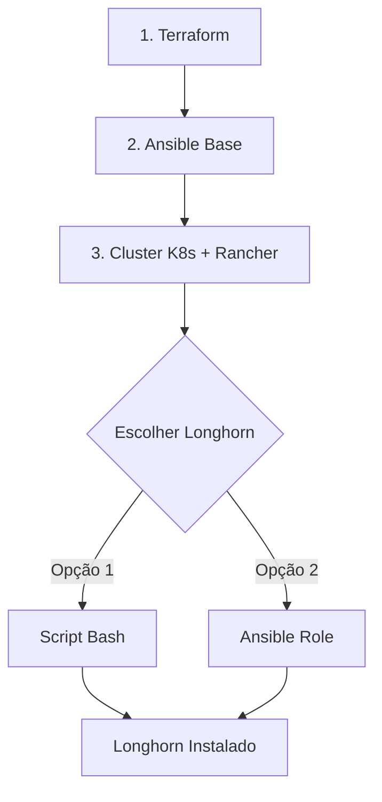

# 🐄 Longhorn: Script vs Ansible

## ❓ **Pergunta: "A instalação do Longhorn é via Ansible?"**

**Resposta**: Implementei **duas opções** para você escolher a que preferir!

## 🔀 **Duas Abordagens Disponíveis**

### **1. 📜 Via Script (Atual - Recomendado)**
```bash
make install-longhorn
```

### **2. 🤖 Via Ansible (Novo - Opcional)**
```bash
make install-longhorn-ansible
```

---

## 📊 **Comparação das Abordagens**

| Aspecto | Script Bash | Ansible |
|---------|-------------|---------|
| **Simplicidade** | ✅ Mais simples | ⚠️ Mais complexo |
| **Dependências** | Apenas kubectl | kubectl + ansible + collections |
| **Logs** | ✅ Detalhados | ⚠️ Mais verbosos |
| **Debug** | ✅ Fácil | ⚠️ Mais difícil |
| **Idempotência** | ✅ Implementada | ✅ Nativa do Ansible |
| **Integração** | Pós-cluster | Pós-cluster |
| **Customização** | Via variáveis | Via variáveis YAML |

---

## 🏗️ **Arquitetura do Projeto**

### **Fluxo Atual (Híbrido):**


### **Por que pós-cluster?**
- ✅ Longhorn é uma **aplicação Kubernetes**
- ✅ Precisa do cluster **funcionando**
- ✅ Usa **kubectl** e **manifests YAML**
- ✅ Não é parte da **instalação base** do OS

---

## 🎯 **Qual Escolher?**

### **Use Script (Recomendado) se:**
- ✅ Quer **simplicidade**
- ✅ Precisa de **debug fácil**
- ✅ Não tem experiência com Ansible
- ✅ Quer **execução rápida**

### **Use Ansible se:**
- ✅ Prefere **padronização** Ansible
- ✅ Quer **integração total** com playbooks
- ✅ Precisa de **customização avançada**
- ✅ Tem **pipeline CI/CD** baseado em Ansible

---

## 🚀 **Como Usar Cada Abordagem**

### **Método 1: Script (Simples)**
```bash
# Após cluster estar funcionando
make validate

# Instalar Longhorn
make install-longhorn

# Testar
make test-longhorn
```

### **Método 2: Ansible (Avançado)**
```bash
# Após cluster estar funcionando
make validate

# Instalar via Ansible
make install-longhorn-ansible

# Testar
make test-longhorn
```

---

## 🔧 **Estrutura Implementada**

### **Script Bash:**
```
scripts/
├── install-longhorn.sh    # Instalação principal
└── test-longhorn.sh       # Teste de funcionalidade
```

### **Ansible Role:**
```
ansible/
├── longhorn-install.yml   # Playbook específico
└── roles/longhorn/
    ├── defaults/main.yml  # Configurações padrão
    └── tasks/main.yml     # Tasks de instalação
```

---

## ⚙️ **Customização**

### **Script - Variáveis no próprio script:**
```bash
# Editar scripts/install-longhorn.sh
LONGHORN_VERSION="v1.5.3"
TIMEOUT="600"
SET_DEFAULT="true"
```

### **Ansible - Variáveis em YAML:**
```yaml
# ansible/group_vars/all.yml ou comando
longhorn_version: "v1.5.3"
longhorn_set_default_storage_class: true
longhorn_wait_timeout: 600
```

---

## 📝 **Comandos Completos**

```bash
# Ver todas as opções
make help

# Status do cluster
make validate
make status

# Longhorn via Script
make install-longhorn
make test-longhorn
make longhorn-status
make longhorn-ui

# Longhorn via Ansible
make install-longhorn-ansible
make test-longhorn
make longhorn-status
make longhorn-ui
```

---

## 🎯 **Recomendação Final**

**Para a maioria dos usuários**: Use `make install-longhorn` (script)
- ✅ Mais simples
- ✅ Debug mais fácil  
- ✅ Menos dependências
- ✅ Funciona igual

**Para ambientes enterprise**: Use `make install-longhorn-ansible`
- ✅ Padronização total
- ✅ Integração com pipelines
- ✅ Configuração declarativa
- ✅ Audit trail completo

---

**Ambas fazem exatamente a mesma coisa - instalam o Longhorn perfeitamente!** 🎉
