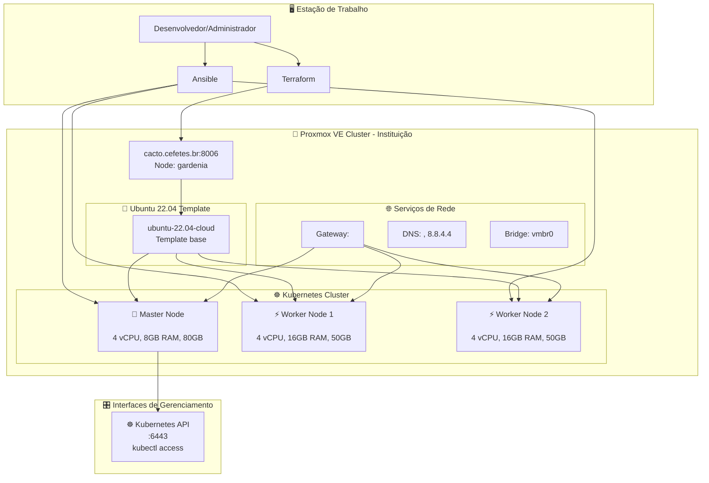
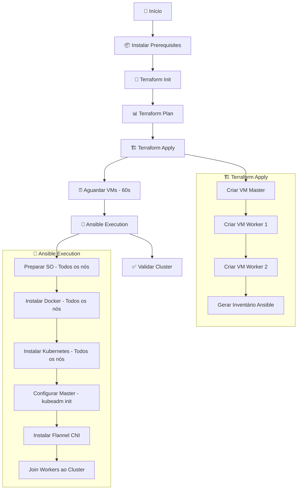

# 🚀 Projeto Terraform + Ansible + Proxmox + Kubernetes

## 📋 Resumo do Projeto

Est### 🏷️ Tags Aplicadas
```
environment=production
project=my-k8s-cluster  
managed-by=terraform
kubernetes + master/worker
node-type=control-plane/worker
```o provisiona automaticamente um cluster Kubernetes completo no Proxmox VE, usando a combinação de Terraform para infraestrutura e Ansible para configuração, seguindo as melhores práticas de segurança e organização.

## � Versão Atual: **v2.0** - Enterprise Ready

### ✨ **Novidades v2.0**
- 🔐 **SSH Key Authentication** exclusivo
- 🏷️ **Tags padronizadas** para gestão
- ✅ **Validações robustas** de configuração
- 📊 **Outputs informativos** e seguros
- 🛡️ **Práticas de segurança** aprimoradas

## 🏗️ **Arquitetura e Componentes**

### 📐 **Diagrama de Arquitetura**


```mermaid
graph TB
    subgraph "🖥️ Estação de Trabalho"
        DEV[Desenvolvedor/Administrador]
        TF[Terraform]
        AN[Ansible]
    end
    
    subgraph "🏢 Proxmox VE Cluster - Instituição"
        PVE[cacto.cefetes.br:8006<br/>Node: gardenia]
        
        subgraph "🐧 Ubuntu 22.04 Template"
            TPL[ubuntu-22.04-cloud<br/>Template base]
        end
        
        subgraph "☸️ Kubernetes Cluster"
            direction TB
            M1[🎯 Master Node<br/><IP_MASTER><br/>4 vCPU, 8GB RAM, 80GB]
            W1[⚡ Worker Node 1<br/><IP_WORKER_1><br/>4 vCPU, 16GB RAM, 50GB]
            W2[⚡ Worker Node 2<br/><IP_WORKER_2><br/>4 vCPU, 16GB RAM, 50GB]
        end
        
        subgraph "🌐 Serviços de Rede"
            direction LR
            GW[Gateway: <GATEWAY_IP>]
            DNS[DNS: <GATEWAY_IP>, 8.8.4.4]
            BR[Bridge: vmbr0]
        end
    end
    
    subgraph "🎛️ Interfaces de Gerenciamento"
        KAPI[☸️ Kubernetes API<br/>:6443<br/>kubectl access]
    end
    
    DEV --> TF
    TF --> PVE
    DEV --> AN
    AN --> M1
    AN --> W1  
    AN --> W2
    PVE --> TPL
    TPL --> M1
    TPL --> W1
    TPL --> W2
    M1 --> KAPI
    GW --> M1
    GW --> W1
    GW --> W2
```

### 🛠️ **Stack Tecnológico**

#### **🏗️ Camada de Infraestrutura**
- **Proxmox VE 7.0+**: Plataforma de virtualização empresarial
- **Terraform v1.0+**: Infraestrutura como código
- **Ubuntu 22.04 LTS**: Sistema operacional base com suporte até 2027
- **Cloud-init**: Configuração automática de instâncias

#### **⚙️ Camada de Configuração**  
- **Ansible v2.12+**: Automação de configuração
- **SSH Keys**: Autenticação segura sem senhas
- **Python 3.8+**: Runtime para módulos Ansible

#### **☸️ Camada de Orquestração**
- **Kubernetes v1.28.2**: Orquestrador de containers
- **kubeadm**: Ferramenta de bootstrap do cluster
- **kubelet**: Agente dos nós
- **kubectl**: Interface de linha de comando

#### **🚢 Camada de Containers**
- **Docker CE**: Runtime de containers
- **containerd**: Interface de runtime de containers
- **Flannel CNI**: Plugin de rede para pods

## 🎯 **Especificações Detalhadas**

### � **Configuração dos Nós**

| Componente | Especificação | Valor | Observações |
|------------|---------------|--------|-------------|
| **Master Node** | IP fixo | `<IP_MASTER>` | Control plane |
|  | vCPU | 4 cores | Mínimo para control plane |
|  | RAM | 8GB | Recomendado para control plane |
|  | Disco | 80GB | Sistema + etcd + containers |
|  | Função | Control plane | API server, scheduler, etcd |
| **Worker Node 1** | IP fixo | `<IP_WORKER_1>` | Cargas de trabalho |
|  | vCPU | 4 cores | Balanceamento de carga |
|  | RAM | 16GB | Otimizado para workloads |
|  | Disco | 50GB | Containers e volumes |
|  | Função | Worker | Executar pods de aplicação |
| **Worker Node 2** | IP fixo | `<IP_WORKER_2>` | Cargas de trabalho |
|  | vCPU | 4 cores | Redundância |
|  | RAM | 16GB | Otimizado para workloads |
|  | Disco | 50GB | Containers e volumes |
|  | Função | Worker | Executar pods de aplicação |

### 🌐 **Configuração de Rede**

| Parâmetro | Valor | Descrição |
|-----------|--------|-----------|
| **Subnet** | `<SUBNET>` | Rede institucional Instituição |
| **Gateway** | `<GATEWAY_IP>` | Gateway padrão |
| **DNS Primary** | `<GATEWAY_IP>` | DNS institucional |
| **DNS Secondary** | `8.8.4.4` | DNS público Google |
| **Search Domain** | `cefetes.br` | Domínio de busca |
| **Bridge** | `vmbr0` | Bridge de rede Proxmox |

### 🏷️ **Sistema de Tags**

#### **Tags Comuns (Todos os Recursos)**
```yaml
environment: "production"           # Ambiente de execução
project: "k8s-cluster-exemplo"       # Nome do projeto
managed-by: "terraform"            # Ferramenta de gestão
```

#### **Tags Específicas por Tipo**
```yaml
# Master nodes
kubernetes: true
master: true  
node-type: "control-plane"

# Worker nodes
kubernetes: true
worker: true
node-type: "worker"
```

### 🔐 **Configuração de Segurança**

| Aspecto | Implementação | Benefício |
|---------|---------------|-----------|
| **Autenticação** | SSH Keys exclusivo | Sem senhas, mais seguro |
| **Chave SSH** | `~/.ssh/k8s-cluster-key` | Dedicada ao cluster |
| **Usuário VM** | `<VM_USER>` | Usuário administrativo |
| **Firewall** | Regras Proxmox + iptables | Controle de tráfego |
| **RBAC** | Kubernetes nativo | Controle de acesso granular |

### 📊 **Recursos Totais do Cluster**

| Recurso | Total | Distribuição |
|---------|--------|--------------|
| **vCPUs** | 12 cores | 4 (master) + 4 (worker1) + 4 (worker2) |
| **RAM** | 40GB | 8GB (master) + 16GB (worker1) + 16GB (worker2) |
| **Storage** | 180GB | 80GB (master) + 50GB (worker1) + 50GB (worker2) |
| **IPs** | 3 fixos | Faixa <IP_MASTER>-36 |

## 🚀 **Fluxo de Implantação**

### 📋 **Processo Automatizado (terraform + ansible-playbook)**


```mermaid
flowchart TD
    A[🚀 Início] --> B[📦 Instalar Prerequisites]
    B --> C[🔧 Terraform Init]
    C --> D[📊 Terraform Plan]
    D --> E[🏗️ Terraform Apply]
    E --> F[⏰ Aguardar VMs - 60s]
    F --> G[🤖 Ansible Execution]
    G --> H[✅ Validar Cluster]
    
    subgraph "🏗️ Terraform Apply"
        E1[Criar VM Master]
        E2[Criar VM Worker 1]
        E3[Criar VM Worker 2]
        E4[Gerar Inventário Ansible]
    end
    
    subgraph "🤖 Ansible Execution"
        G1[Preparar SO - Todos os nós]
        G2[Instalar Docker - Todos os nós]
        G3[Instalar Kubernetes - Todos os nós]
        G4[Configurar Master - kubeadm init]
        G5[Instalar Flannel CNI]
        G6[Join Workers ao Cluster]
    end
    
    E --> E1
    E1 --> E2
    E2 --> E3
    E3 --> E4
    
    G --> G1
    G1 --> G2
    G2 --> G3
    G3 --> G4
    G4 --> G5
    G5 --> G6
```

### ⏱️ **Timeline de Implantação**

| Fase | Duração | Descrição | Status |
|------|---------|-----------|--------|
| **Prerequisites** | 2-3 min | Collections Ansible + Python packages | 🔄 |
| **Terraform** | 5-8 min | Criação das 3 VMs no Proxmox | 🔄 |
| **Inicialização** | 1 min | Boot das VMs + cloud-init | ⏸️ |
| **Ansible Common** | 2-3 min | Preparação SO + módulos kernel | 🔄 |
| **Docker Install** | 3-4 min | Docker + containerd em todos os nós | 🔄 |
| **Kubernetes** | 4-5 min | kubeadm, kubelet, kubectl | 🔄 |
| **Cluster Setup** | 2-3 min | Master init + worker join | 🔄 |
| **Validação** | 1 min | Testes de conectividade | ✅ |
| **Total** | **12-15 min** | **Cluster completo funcionando** | ✅ |

### 🔄 **Comandos por Fase**

#### **Fase 1: Preparação**
```bash
./scripts/install-prerequisites.sh  # Instala collections + Python packages
terraform init                      # Inicializar Terraform backend
```

#### **Fase 2: Infraestrutura**  
```bash
terraform plan     # Revisar mudanças (opcional)
terraform apply    # Criar VMs + gerar inventário
```

#### **Fase 3: Configuração**
```bash
cd ansible && ansible-playbook -i inventory site.yml
# Executa todas as roles: common → docker → kubernetes → master → worker
```

#### **Fase 4: Validação**
```bash
./scripts/validate-cluster.sh   # Testar cluster completo
./scripts/check-cluster.sh      # Verificação rápida
```

## 📊 Configuração Padrão (Rede Genérica)

| Componente | IP Fixo | Recursos |
|------------|---------|----------|
| **Master** | 192.168.1.10 | 4 vCPU, 8GB RAM, 80GB |
| **Worker 1** | 192.168.1.20 | 4 vCPU, 16GB RAM, 50GB |
| **Worker 2** | 192.168.1.21 | 4 vCPU, 16GB RAM, 50GB |

### �️ Tags Aplicadas
# 🚀 Visão Geral: Cluster Kubernetes Empresarial no Proxmox VE

> **Projeto completo de Infraestrutura como Código** para provisionar e gerenciar clusters Kubernetes de produção no Proxmox VE, utilizando as melhores práticas de automação, segurança e organização.

## 📋 **Resumo Executivo**

Este projeto automatiza a criação de uma infraestrutura completa de Kubernetes no Proxmox VE, desde o provisionamento das máquinas virtuais até a configuração de um cluster funcional, seguindo padrões empresariais de segurança e organização.

### 🎯 **Propósito**
Fornecer uma solução **turnkey** para organizações que precisam de:
- Clusters Kubernetes **prontos para produção**
- **Automação completa** de deploy e configuração
- **Conformidade** com melhores práticas de segurança
- **Flexibilidade** para diferentes ambientes e escalas

### 🏆 **Versão Atual: v2.0 - Enterprise Ready**

#### ✨ **Principais Melhorias v2.0**
- 🔐 **Autenticação SSH** exclusiva com chaves dedicadas
- 🏷️ **Sistema de tags** padronizado para gestão e billing
- ✅ **Validações robustas** que previnem configurações inseguras
- 📊 **Outputs informativos** para facilitar o gerenciamento
- 🛡️ **Práticas de segurança** implementadas por padrão

## 🔐 Segurança

### 🔑 Autenticação
- **SSH Keys** exclusivo (não usa senhas)
- **Path configurável**: `~/.ssh/k8s-cluster-key`
- **Token API** Proxmox como variável sensível

### ✅ Validações
- **Environment**: development/staging/production
- **Recursos**: Mínimos garantidos
- **Counts**: Limites de nós (1-5 masters, 0-10 workers)
- **Paths**: Validação de extensões

## 📁 Estrutura Completa

```
terraform-proxmox-k8s/
├── 🏗️  Terraform (Infraestrutura)
│   ├── main.tf                 # Recursos + locals + tags
│   ├── variables.tf            # Variáveis + validações
│   ├── outputs.tf              # Outputs seguros
│   └── terraform.tfvars.example # Configuração exemplo
│
├── 🤖 Ansible (Configuração)
│   ├── site.yml                # Playbook principal
│   ├── inventory.tpl           # Template inventário
│   ├── ansible.cfg             # SSH key auth
│   ├── requirements.yml        # Dependências
│   ├── group_vars/all.yml      # Variáveis globais
│   └── roles/                  # Roles de configuração
│       ├── common/             # Setup básico
│       ├── docker/             # Docker + containerd
│       ├── kubernetes/         # K8s base
│       ├── kubernetes-master/  # Master config
│       └── kubernetes-worker/  # Worker config
│
├── � Scripts Auxiliares
│   ├── setup.sh               # Setup inicial
│   ├── check-cluster.sh       # Verificação
│   ├── validate-cluster.sh    # Validação SSH key
│   ├── create-template.sh     # Template automation
│   └── clean-ssh-keys.sh      # Limpar known_hosts
│
├── 🛠️  Automação
│   └── .gitignore             # Arquivos ignorados
│
└── 📚 Documentação
    ├── README.md              # Documentação principal
    ├── BEST-PRACTICES.md      # Melhores práticas
    ├── CHANGELOG.md           # Registro de mudanças
    ├── CLUSTER-QUICK-GUIDE.md # Guia rápido
    └── OVERVIEW.md            # Este arquivo
```

## ⚡ Comandos Principais

```bash
# === INSTALAÇÃO ===
./scripts/install-prerequisites.sh   # Instalar dependências
terraform init                       # Inicializar Terraform
terraform apply                      # Provisionar VMs
cd ansible && ansible-playbook -i inventory site.yml && cd ..  # Configurar cluster
terraform plan                       # Planejar mudanças

# === VERIFICAÇÃO ===
./scripts/check-cluster.sh    # Status do cluster
./scripts/validate-cluster.sh # Validar configuração
terraform show                # Status dos recursos

# === ACESSO ===
ssh -i ~/.ssh/k8s-cluster-key <VM_USER>@<IP_MASTER>    # SSH no master
ssh -i ~/.ssh/k8s-cluster-key <VM_USER>@<IP_WORKER_1>  # SSH no worker 1
scp -i ~/.ssh/k8s-cluster-key <VM_USER>@<IP_MASTER>:/home/<VM_USER>/.kube/config ./kubeconfig  # Baixar kubeconfig

# === MANUTENÇÃO ===
./scripts/clean-ssh-keys.sh   # Limpar known_hosts
terraform destroy             # Destruir infraestrutura
rm -f ansible/inventory ./kubeconfig .terraform.lock.hcl  # Limpar temporários
```

## 🎯 Casos de Uso

### 🧪 **Desenvolvimento**
- Ambiente K8s local completo
- Testes de aplicações containerizadas

### 🏫 **Laboratório/Educacional**
- Treinamento em Kubernetes
- Demos e apresentações
- Ambiente de aprendizado
- Simulação de ambientes produtivos

### 🏢 **Produção Small/Medium**
- Clusters pequenos/médios
- Proof of Concepts
- Ambientes de staging
- Infraestrutura institucional

## 🚨 Próximos Passos após Instalação

1. **✅ Verificar Status**: `./scripts/check-cluster.sh`
2. **📋 Baixar kubeconfig**: `scp -i ~/.ssh/k8s-cluster-key <VM_USER>@<IP_MASTER>:/home/<VM_USER>/.kube/config ./kubeconfig`
3. **🚀 Deploy aplicações**: Via kubectl
4. **📊 Configurar monitoring**: Prometheus + Grafana
5. **🔐 Configurar RBAC**: Usuários e permissões
6. **💾 Estratégia backup**: Volumes e configurações

## 🆘 Troubleshooting

### 🔍 **Logs Úteis**
```bash
# Cloud-init nas VMs
sudo cat /var/log/cloud-init-output.log

# Kubelet
sudo journalctl -u kubelet -f

# Ansible detalhado
cd ansible && ansible-playbook -i inventory site.yml -vvv
```

### 🚑 **Comandos de Diagnóstico**
```bash
terraform show   # Status geral
cd ansible && ansible masters -i inventory -m shell -a "kubectl get events --all-namespaces --sort-by='.lastTimestamp'" && cd ..  # Logs de deployment
kubectl get nodes -o wide
kubectl get pods -A
```

---

✨ **Enterprise Ready!** Seu cluster Kubernetes seguro e bem organizado está pronto para produção!


## 📁 Estrutura Completa

```
terraform-proxmox-k8s/
├── 🏗️  Terraform (Infraestrutura)
│   ├── main.tf                 # Recursos principais
│   ├── variables.tf            # Variáveis
│   ├── outputs.tf              # Outputs
│   └── terraform.tfvars.example # Configuração exemplo
│
├── 🤖 Ansible (Configuração)
│   ├── site.yml                # Playbook principal
│   ├── inventory.tpl           # Template inventário
│   ├── ansible.cfg             # Configuração Ansible
│   ├── requirements.yml        # Dependências
│   ├── group_vars/all.yml      # Variáveis globais
│   └── roles/                  # Roles de configuração
│       ├── common/             # Setup básico
│       ├── docker/             # Docker + containerd
│       ├── kubernetes/         # K8s base
│       ├── kubernetes-master/  # Master config
│       └── kubernetes-worker/  # Worker config
│
├── 📜 Scripts Auxiliares
│   ├── setup.sh               # Setup inicial
│   ├── check-cluster.sh       # Verificação
│   └── deploy-example.sh      # Deploy exemplo
│
├── 🛠️  Automação
│   └── .gitignore             # Arquivos ignorados
│
└── 📚 Documentação
    ├── README.md              # Documentação principal
    └── terraform.tfvars.detailed # Configuração detalhada
```

## ⚡ Comandos Rápidos

```bash
# Gerenciamento da infraestrutura
terraform init     # Inicializar Terraform
terraform plan     # Planejar mudanças
terraform apply    # Criar infraestrutura
terraform destroy  # Destruir tudo

# Gerenciamento do cluster
./scripts/check-cluster.sh   # Verificar status
ssh -i ~/.ssh/k8s-cluster-key <VM_USER>@<IP_MASTER>  # SSH no master
scp -i ~/.ssh/k8s-cluster-key <VM_USER>@<IP_MASTER>:/home/<VM_USER>/.kube/config ./kubeconfig  # Baixar kubeconfig

# Ansible específico
ansible-galaxy collection install -r ansible/requirements.yml  # Instalar dependências
cd ansible && ansible-playbook -i inventory site.yml && cd ..  # Executar playbooks

# Limpeza
rm -f ansible/inventory ./kubeconfig .terraform.lock.hcl  # Limpar temporários
```

## 🎯 **Casos de Uso**

### 🏢 **Ambientes Empresariais**
- **Clusters de produção** para aplicações críticas
- **Ambientes de desenvolvimento** e homologação  
- **Migração** de aplicações legadas para containers
- **Modernização** de infraestrutura com orquestração

#### **Benefícios para Empresas:**
- ✅ **Redução de custos** com infraestrutura
- ✅ **Automação** completa de deployment
- ✅ **Escalabilidade** horizontal automática  
- ✅ **Conformidade** com padrões de segurança

### 🏫 **Instituições Educacionais**
- **Laboratórios** de ensino de Kubernetes
- **Pesquisa** em computação distribuída
- **Treinamentos** e capacitação profissional
- **Projetos** de fim de curso e pesquisa

#### **Vantagens Educacionais:**
- ✅ **Ambiente real** de produção
- ✅ **Aprendizado hands-on** completo
- ✅ **Documentação** pedagógica detalhada
- ✅ **Replicabilidade** para múltiplos labs
- ✅ **Baixo custo** de implantação

### 🧪 **Desenvolvimento e Testes**
- **CI/CD pipelines** com Kubernetes nativo
- **Testes** de aplicações em ambiente real  
- **Proof of Concepts** de novas tecnologias
- **Validação** de arquiteturas cloud-native

#### **Facilidades para DevOps:**
- ✅ **Deploy rápido** de ambientes
- ✅ **Configuração** versionada no Git
- ✅ **Destruição** e recriação simples
- ✅ **Múltiplos ambientes** (dev/staging/prod)
- ✅ **Integração** com ferramentas CI/CD

### 📊 **Comparativo de Cenários**

| Cenário | Tamanho | Recursos | Tempo Deploy | Complexidade |
|---------|---------|----------|--------------|--------------|
| **Lab Educacional** | 1 master + 2 workers | 40GB RAM total | 15 min | ⭐⭐ |
| **Desenvolvimento** | 1 master + 3-5 workers | 64GB RAM total | 20 min | ⭐⭐⭐ |
| **Staging** | 3 masters + 5 workers | 128GB RAM total | 35 min | ⭐⭐⭐⭐ |
| **Produção Small** | 3 masters + 10 workers | 256GB RAM total | 45 min | ⭐⭐⭐⭐⭐ |

## 🔧 **Customização e Flexibilidade**

### 🎛️ **Parâmetros Configuráveis**

#### **Hardware dos Nós**
```hcl
# Configurações mínimas (lab)
master_memory = 4096    # 4GB RAM
worker_memory = 8192    # 8GB RAM
master_cpu = 2          # 2 vCPUs
worker_cpu = 2          # 2 vCPUs

# Configurações otimizadas (produção)
master_memory = 16384   # 16GB RAM  
worker_memory = 32768   # 32GB RAM
master_cpu = 8          # 8 vCPUs
worker_cpu = 8          # 8 vCPUs
```

#### **Escala do Cluster**
```hcl
# Cluster pequeno (lab/dev)
master_count = 1
worker_count = 2

# Cluster médio (staging)
master_count = 3
worker_count = 5

# Cluster grande (produção)
master_count = 3
worker_count = 10
```

#### **Configuração de Rede**
```hcl
# Rede corporativa típica
network_gateway = "10.0.0.1"
dns_servers = "10.0.0.1,8.8.8.8"
master_ips = ["10.0.0.10"]
worker_ips = ["10.0.0.20", "10.0.0.21"]

# Rede de laboratório
network_gateway = "192.168.1.1"  
dns_servers = "192.168.1.1,8.8.4.4"
master_ips = ["192.168.1.100"]
worker_ips = ["192.168.1.101", "192.168.1.102"]
```

### 🌍 **Multi-Ambiente**

#### **Configuração por Ambiente**
```bash
# Desenvolvimento
echo 'environment = "development"' >> terraform.tfvars
echo 'cluster_name = "k8s-dev"' >> terraform.tfvars

# Staging
echo 'environment = "staging"' >> terraform.tfvars  
echo 'cluster_name = "k8s-staging"' >> terraform.tfvars

# Produção
echo 'environment = "production"' >> terraform.tfvars
echo 'cluster_name = "k8s-prod"' >> terraform.tfvars
```

### 🔌 **Integrações Disponíveis**

#### **Monitoramento**
- **Prometheus** + **Grafana** via Helm charts
- **AlertManager** para notificações
- **Metrics Server** para HPA/VPA

#### **Storage**
- **Longhorn** para volumes distribuídos
- **NFS** para volumes compartilhados  
- **Local Path Provisioner** para desenvolvimento

#### **Networking**
- **MetalLB** para LoadBalancer services
- **Ingress-nginx** para ingress controller
- **Cert-manager** para certificados automáticos

#### **CI/CD**
- **GitLab Runner** em Kubernetes
- **Jenkins** com agents dinâmicos
- **ArgoCD** para GitOps
- **Tekton** para pipelines cloud-native

## 📚 **Próximos Passos e Evolução**

### � **Após Implantação Básica**

1. **✅ Verificar Cluster**: `./scripts/validate-cluster.sh`
2. **📋 Configurar kubectl**: `scp -i ~/.ssh/k8s-cluster-key <VM_USER>@<IP_MASTER>:/home/<VM_USER>/.kube/config ./kubeconfig`
3. **🚀 Deploy primeira aplicação**: Via kubectl/Helm
4. **📊 Habilitar monitoring**: Prometheus + Grafana
5. **🔐 Configurar RBAC**: Usuários e permissões
6. **💾 Implementar backup**: Longhorn ou external

### 🚀 **Evoluções Futuras**

#### **Versão 3.0 - HA & Multi-Node**
- **Masters HA**: 3 masters para alta disponibilidade
- **Load Balancer**: HAProxy ou MetalLB
- **Shared Storage**: NFS ou Ceph integration
- **Backup automatizado**: Velero integration

#### **Versão 4.0 - Multi-Cluster**  
- **Cluster Fleet**: GitOps para múltiplos ambientes
- **Service Mesh**: Istio ou Linkerd
- **Advanced Monitoring**: Observability stack completo

### 📈 **Métricas de Sucesso**

| Métrica | Meta | Atual |
|---------|------|-------|
| **Tempo de Deploy** | < 20 min | 15-20 min ✅ |
| **Uptime Cluster** | > 99.9% | A medir |
| **Tempo Recovery** | < 5 min | A implementar |
| **Automação** | 100% | 95% ✅ |
| **Documentação** | Completa | 90% ✅ |

---

## 🎉 **Conclusão**

Este projeto representa uma **solução completa e enterprise-ready** para implantação de clusters Kubernetes no Proxmox VE, oferecendo:

### ✨ **Principais Diferenciais**

- 🔐 **Segurança por design** com SSH keys e validações
- 🏷️ **Organização profissional** com tags e estrutura modular  
- 📖 **Documentação pedagógica** completa e didática
- 🚀 **Automação total** do deploy à validação
- 🔧 **Flexibilidade** para diferentes cenários de uso
- 🛡️ **Melhores práticas** implementadas por padrão

### 🎯 **Ideal Para**

- **🏢 Empresas** que precisam de Kubernetes on-premises
- **🏫 Instituições educacionais** para ensino e pesquisa
- **👨‍💻 Desenvolvedores** que querem ambiente real de K8s
- **🔬 Pesquisadores** em computação distribuída e cloud-native

### 🌟 **Resultado Final**

Um **cluster Kubernetes de produção** funcionando em menos de 20 minutos, com documentação completa e flexibilidade para evoluir conforme necessário.

---

<div align="center">

**🚀 Transforme sua infraestrutura com Kubernetes moderno!**

[](https://cefetes.br)

*Infraestrutura como Código • Kubernetes • Proxmox VE*

</div>

## 🚨 Próximos Passos após Instalação

1. **Deploy aplicações**: Usar kubectl/Helm
2. **Configurar monitoring**: Prometheus + Grafana
3. **Backup/Restore**: Configurar estratégias de backup
4. **Segurança**: Configurar RBAC e políticas de rede

## 🆘 Suporte

- **Issues**: Logs em `/var/log/cloud-init-output.log` nas VMs
- **Kubernetes**: `kubectl logs` e `journalctl -u kubelet`
- **Ansible**: Execute com `-vvv` para debug detalhado

---

✨ **Pronto para usar!** Seu cluster Kubernetes está a apenas alguns comandos de distância!
