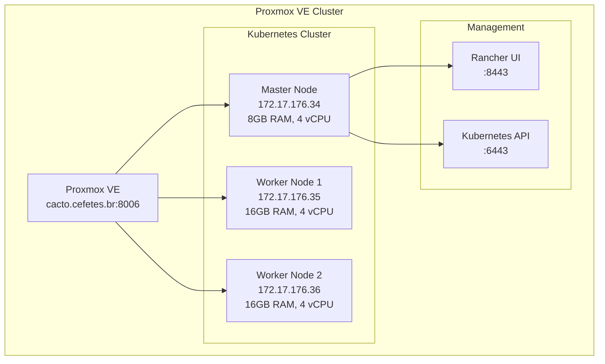

# 🚀 Cluster Kubernetes no Proxmox VE com Rancher

[](https://terraform.io)
[](https://ansible.com)
[](https://kubernetes.io)
[](https://rancher.com)
[](https://ubuntu.com)

> **Infraestrutura como Código** completa para provisionar e configurar um cluster Kubernetes empresarial no Proxmox VE, com interface de gerenciamento Rancher e automação total via Terraform + Ansible.

## 🎯 **Objetivo**

Este projeto automatiza a criação de um cluster Kubernetes de produção no Proxmox VE, seguindo as melhores práticas de segurança, organização e manutenibilidade, ideal para:

- 🏢 **Ambientes empresariais** e institucionais
- 🧪 **Laboratórios** e ambientes de desenvolvimento  
- 📚 **Treinamento** e educação em Kubernetes
- 🚀 **Proof of Concepts** e projetos piloto

## ✨ **Características Principais**

### 🔧 **Automação Total**
- **Terraform**: Provisionamento da infraestrutura no Proxmox VE
- **Ansible**: Configuração automática do sistema operacional e Kubernetes
- **Make**: Comandos simplificados para todo o ciclo de vida

### 🛡️ **Segurança Enterprise**
- **SSH Key Authentication**: Autenticação exclusiva por chaves SSH
- **IPs Fixos**: Controle total da topologia de rede  
- **Validações Robustas**: Prevenção de configurações inseguras
- **Variáveis Sensíveis**: Proteção de tokens e credenciais

### 🏷️ **Organização Profissional**
- **Tags Padronizadas**: Identificação e billing automatizado
- **Multi-ambiente**: Suporte a dev/staging/production
- **Documentação Completa**: Guias detalhados e best practices
- **Estrutura Modular**: Código organizado e reutilizável

## � **Arquitetura e Configuração**

### 🏗️ **Topologia do Cluster**



### 🖥️ **Especificações dos Nós**

| Componente | IP Fixo | vCPU | RAM | Disco | Função |
|------------|---------|------|-----|-------|--------|
| **Master** | `172.17.176.34` | 4 | 8GB | 80GB | Control Plane + Rancher |
| **Worker 1** | `172.17.176.35` | 4 | 16GB | 50GB | Cargas de trabalho |
| **Worker 2** | `172.17.176.36` | 4 | 16GB | 50GB | Cargas de trabalho |

### 🌐 **Pontos de Acesso**

| Serviço | URL/Endpoint | Credenciais | Descrição |
|---------|--------------|-------------|-----------|
| **Rancher UI** | `https://172.17.176.34:8443` | `admin` / `admin123` | Interface de gerenciamento |
| **Kubernetes API** | `https://172.17.176.34:6443` | Via kubeconfig | API do cluster |
| **SSH Master** | `ssh admviana@172.17.176.34` | Chave SSH | Acesso direto ao master |
| **SSH Workers** | `ssh admviana@172.17.176.35-36` | Chave SSH | Acesso direto aos workers |

## 📋 **Pré-requisitos**

### 🖥️ **Infraestrutura Proxmox VE**
- **Proxmox VE** 7.0+ com cluster configurado
- **Template Ubuntu 22.04** cloud-init criado no nó "gardenia"
- **Token API** configurado com permissões administrativas
- **Recursos mínimos**: 12 vCPU, 40GB RAM, 180GB storage

### 🛠️ **Estação de Trabalho**
```bash
# Verificar pré-requisitos instalados
terraform version    # >= 1.0
ansible --version    # >= 2.12  
python3 --version    # >= 3.8
git --version        # Para versionamento
ssh -V              # Cliente SSH
```

### 🔐 **Configuração de Autenticação**

#### **1. Chaves SSH Dedicadas**
```bash
# Gerar par de chaves SSH exclusivo para o cluster
ssh-keygen -t rsa -b 4096 -f ~/.ssh/k8s-cluster-key -C "k8s-cluster@cefetes.br"

# Verificar criação das chaves
ls -la ~/.ssh/k8s-cluster-key*
-rw-------  1 user user 3243 Aug 13 10:00 /home/user/.ssh/k8s-cluster-key
-rw-r--r--  1 user user  739 Aug 13 10:00 /home/user/.ssh/k8s-cluster-key.pub
```

#### **2. Token API do Proxmox**
1. Acesse: `https://cacto.cefetes.br:8006`
2. Navegue: **Datacenter** → **Permissions** → **API Tokens**
3. Crie token para `root@pam` com **Privilege Separation = false**
4. Anote: **Token ID** e **Secret** (usado apenas uma vez)

### 🐧 **Template Ubuntu 22.04**

#### **Opção A: Script Automatizado (Recomendado)**
```bash
# Download e execução do script
chmod +x scripts/create-template.sh
./scripts/create-template.sh
```

#### **Opção B: Criação Manual**
```bash
# Executar no shell do Proxmox VE (nó gardenia)
wget https://cloud-images.ubuntu.com/jammy/current/jammy-server-cloudimg-amd64.img
qm create 9000 --name ubuntu-22.04-cloud --memory 2048 --cores 2 --net0 virtio,bridge=vmbr0
qm importdisk 9000 jammy-server-cloudimg-amd64.img local-lvm
qm set 9000 --scsihw virtio-scsi-pci --scsi0 local-lvm:vm-9000-disk-0
qm set 9000 --boot c --bootdisk scsi0
qm set 9000 --scsi1 local-lvm:cloudinit
qm set 9000 --vga qxl --agent enabled=1
qm template 9000
```

## ⚡ **Instalação Rápida**

### 🎯 **Método Express (Recomendado)**

```bash
# 1. Clonar repositório
git clone <este-repositorio>
cd terraform-proxmox-k8s
chmod +x scripts/*.sh

# 2. Configurar autenticação
ssh-keygen -t rsa -b 4096 -f ~/.ssh/k8s-cluster-key -C "k8s-cluster@cefetes.br"

# 3. Configurar variáveis
cp terraform.tfvars.example terraform.tfvars
nano terraform.tfvars  # Editar com suas configurações

# 4. Instalação completa
make install
```

**⏱️ Tempo estimado:** 15-20 minutos

### 📝 **Configuração Essencial**

Edite o arquivo `terraform.tfvars` com suas informações:

```hcl
# ========================================
# CONFIGURAÇÕES PROXMOX VE - OBRIGATÓRIO
# ========================================
proxmox_api_url          = "https://cacto.cefetes.br:8006/api2/json"
proxmox_api_token_id     = "root@pam!terraform"
proxmox_api_token_secret = "xxxxxxxx-xxxx-xxxx-xxxx-xxxxxxxxxxxx"
proxmox_node             = "gardenia"

# ========================================
# CONFIGURAÇÕES DO CLUSTER
# ========================================
cluster_name     = "k8s-cluster-viana"
environment      = "production"
template_name    = "ubuntu-22.04-cloud"

# ========================================
# CONFIGURAÇÕES DE REDE (CEFETES)
# ========================================
network_bridge  = "vmbr0"
network_gateway = "172.17.176.1" 
dns_servers     = "172.17.176.1,8.8.4.4"
search_domain   = "cefetes.br"

# IPs fixos para os nós
master_ips = ["172.17.176.34"]
worker_ips = ["172.17.176.35", "172.17.176.36"]

# ========================================
# CONFIGURAÇÕES DE SEGURANÇA
# ========================================
ssh_public_key_path = "~/.ssh/k8s-cluster-key.pub"
vm_user            = "admviana"
vm_password        = "abc@123"  # Backup apenas, SSH keys é o padrão
```

### 🚀 **Execução Passo a Passo**

Se preferir controle total:

```bash
# 1. Instalar dependências
make prerequisites

# 2. Inicializar Terraform
make init

# 3. Visualizar plano
make plan

# 4. Aplicar infraestrutura
make apply

# 5. Verificar cluster
make validate
```

## 🎉 **Pós-Instalação**

### ✅ **Verificação do Cluster**

```bash
# Status geral do cluster
make validate

# Verificar conectividade SSH
make ping

# Status detalhado dos recursos
make status
```

### 🌐 **Acesso ao Rancher**

1. **Abrir navegador**: `https://172.17.176.34:8443`
2. **Credenciais iniciais**:
   - **Usuário**: `admin`
   - **Senha**: `admin123`
3. **Configurar nova senha** (recomendado na primeira vez)

### 📋 **Configurar kubectl Local**

```bash
# Baixar kubeconfig do cluster
make get-kubeconfig

# Verificar funcionamento
kubectl --kubeconfig=./kubeconfig get nodes
kubectl --kubeconfig=./kubeconfig get pods --all-namespaces

# Configurar como padrão (opcional)
cp ./kubeconfig ~/.kube/config
kubectl get nodes
```

### 🔗 **Acesso SSH aos Nós**

```bash
# Master node
make ssh-master
# ou: ssh -i ~/.ssh/k8s-cluster-key admviana@172.17.176.34

# Worker nodes
ssh -i ~/.ssh/k8s-cluster-key admviana@172.17.176.35
ssh -i ~/.ssh/k8s-cluster-key admviana@172.17.176.36
```

## 🛠️ **Comandos de Gerenciamento**

### 📊 **Monitoramento**
```bash
make status           # Status da infraestrutura
make validate         # Validar cluster completo
make logs            # Ver logs do deployment
make check           # Verificação rápida
```

### 🔧 **Manutenção** 
```bash
make clean-ssh-keys  # Limpar known_hosts (útil para VMs recriadas)
make rancher-info    # Informações de acesso ao Rancher
make urls            # Todas as URLs de acesso
```

### 🧹 **Limpeza**
```bash
make clean           # Limpar arquivos temporários
make destroy         # Destruir toda a infraestrutura
```

## 📁 **Estrutura do Projeto**

```
📂 terraform-proxmox-k8s/
├── 🏗️  Infraestrutura (Terraform)
│   ├── main.tf                      # Recursos principais do Proxmox
│   ├── variables.tf                 # Variáveis com validações
│   ├── outputs.tf                   # Outputs informativos
│   ├── locals.tf                    # Configurações locais
│   └── terraform.tfvars.example     # Template de configuração
│
├── 🤖 Configuração (Ansible)
│   ├── site.yml                     # Playbook principal
│   ├── inventory.tpl                # Template do inventário
│   ├── ansible.cfg                  # Configuração SSH
│   ├── requirements.yml             # Collections necessárias
│   ├── group_vars/all.yml           # Variáveis globais
│   └── roles/                       # Roles de configuração
│       ├── common/                  # Preparação do sistema
│       ├── docker/                  # Docker + containerd
│       ├── kubernetes/              # Kubernetes base
│       ├── kubernetes-master/       # Configuração do master
│       ├── kubernetes-worker/       # Configuração dos workers
│       └── rancher/                 # Instalação do Rancher
│
├── 📜 Scripts Auxiliares
│   ├── install-prerequisites.sh     # Instalação de dependências
│   ├── validate-cluster.sh          # Validação do cluster
│   ├── create-template.sh           # Criação de templates
│   └── check-cluster.sh             # Verificação rápida
│
├── 🛠️  Automação
│   ├── Makefile                     # Comandos simplificados
│   └── setup.sh                     # Setup inicial
│
├── 📚 Documentação
│   ├── README.md                    # Este arquivo
│   ├── OVERVIEW.md                  # Visão geral do projeto  
│   ├── BEST-PRACTICES.md            # Melhores práticas
│   ├── CLUSTER-QUICK-GUIDE.md       # Guia rápido
│   ├── CHANGELOG.md                 # Histórico de mudanças
│   └── docs/                        # Documentação adicional
│
└── 📊 Logs e Outputs
    ├── logs/                        # Logs de execução
    └── ansible/inventory             # Inventário gerado (auto)
```

## 🔧 **Personalização Avançada**

### 🖥️ **Alterar Recursos das VMs**

```hcl
# Editar terraform.tfvars
# Masters com mais recursos
master_memory    = 16384  # 16GB RAM
master_cpu       = 8      # 8 vCPUs
master_disk_size = "120G"

# Workers otimizados
worker_memory    = 32768  # 32GB RAM  
worker_cpu       = 8      # 8 vCPUs
worker_disk_size = "200G"
```

### 📈 **Expandir o Cluster**

```hcl
# Adicionar mais workers
worker_count = 5
worker_ips   = [
  "172.17.176.35",
  "172.17.176.36", 
  "172.17.176.37",
  "172.17.176.38",
  "172.17.176.39"
]
```

### 🌐 **Configurar Rede Personalizada**

```hcl
# Para outras redes/instituições
network_gateway = "10.0.0.1"
dns_servers     = "10.0.0.1,8.8.8.8"
search_domain   = "minha-empresa.com"

master_ips = ["10.0.0.10"]
worker_ips = ["10.0.0.20", "10.0.0.21"]
```

### 🔒 **Ambientes Múltiplos**

```bash
# Desenvolvimento
echo 'environment = "development"' >> terraform.tfvars

# Staging  
echo 'environment = "staging"' >> terraform.tfvars

# Produção
echo 'environment = "production"' >> terraform.tfvars
```

## Troubleshooting

### VMs não inicializam
- Verifique se o template existe no Proxmox
- Confirme se o nome do nó está correto
- Verifique se há recursos suficientes

### Erro de SSH
- Confirme se a chave SSH está correta
- Verifique se as VMs têm acesso à internet
- Confirme se o cloud-init está funcionando

### Cluster não forma
- Verifique logs: `journalctl -u kubelet`
- Confirme conectividade entre nós
- Verifique se as portas necessárias estão abertas

### Comandos úteis

```bash
# Ver status das VMs no Proxmox
pvesh get /cluster/resources --type vm

# Logs do cloud-init nas VMs
sudo cat /var/log/cloud-init-output.log

# Status do kubelet
sudo systemctl status kubelet

# Logs do kubelet
sudo journalctl -u kubelet -f
```

## Limpeza

Para destruir toda a infraestrutura:

```bash
terraform destroy
```

## Componentes instalados

- **Docker**: Container runtime
- **Kubernetes 1.28**: Orquestrador de containers
- **Flannel**: Plugin de rede para pods
- **containerd**: Container runtime interface
- **cert-manager**: Gerenciamento de certificados
- **Rancher**: Plataforma de gerenciamento Kubernetes

## Rancher - Funcionalidades

O Rancher fornece:
- Interface web para gerenciar clusters Kubernetes
- Gestão de usuários e permissões
- Monitoramento e alertas
- Catálogo de aplicações
- Backup e restore
- Gestão de projetos e namespaces

## 🆘 **Troubleshooting**

### 🔍 **Problemas Comuns**

#### **VMs não inicializam**
```bash
# Verificar template no nó correto
ssh root@gardenia "qm list | grep ubuntu-22.04-cloud"

# Verificar recursos disponíveis
pvesh get /nodes/gardenia/status

# Logs das VMs
ssh root@gardenia "qm status <VMID>"
```

#### **Erro de SSH/Conexão**
```bash
# Limpar known_hosts (VMs recriadas)
make clean-ssh-keys

# Testar conectividade
make ping

# Verificar chaves SSH
ssh-add -l
ssh-add ~/.ssh/k8s-cluster-key
```

#### **Cluster Kubernetes não forma**
```bash
# Logs do kubelet no master
ssh -i ~/.ssh/k8s-cluster-key admviana@172.17.176.34 "sudo journalctl -u kubelet -f"

# Status dos pods do sistema
kubectl --kubeconfig=./kubeconfig get pods -n kube-system

# Verificar conectividade entre nós
ansible all -i ansible/inventory -m ping
```

#### **Rancher não acessa**
```bash
# Status dos pods do Rancher
kubectl --kubeconfig=./kubeconfig get pods -n cattle-system

# Logs do Rancher
kubectl --kubeconfig=./kubeconfig logs -n cattle-system -l app=rancher

# Verificar cert-manager
kubectl --kubeconfig=./kubeconfig get pods -n cert-manager
```

### 🔧 **Comandos de Diagnóstico**

```bash
# Status geral completo
make status

# Logs detalhados
make logs

# Debug do cloud-init (nas VMs)
sudo cat /var/log/cloud-init-output.log

# Debug do Ansible (verbose)
cd ansible && ansible-playbook -i inventory site.yml -vvv

# Recursos do Proxmox
pvesh get /cluster/resources --type vm
pvesh get /cluster/resources --type storage
```

### 🚑 **Soluções Rápidas**

```bash
# Reiniciar serviços Kubernetes
sudo systemctl restart kubelet

# Reiniciar deployment do Rancher  
kubectl rollout restart deployment/rancher -n cattle-system

# Recriar cluster (destruir e criar novamente)
make destroy
make install

# Aplicar apenas configuração (sem destruir VMs)
cd ansible && ansible-playbook -i inventory site.yml
```

## 🔐 **Segurança e Melhores Práticas**

### ✅ **Implementado**
- 🔐 **SSH Keys**: Autenticação exclusiva por chaves
- 🏷️ **Tags**: Sistema padronizado para organização
- ✅ **Validações**: Prevenção de configurações inseguras  
- 🔒 **Variáveis Sensíveis**: Proteção de tokens/senhas
- 📝 **Logs**: Rastreabilidade completa de ações

### 🔧 **Recomendações Adicionais**

```bash
# Usar variáveis de ambiente em produção
export TF_VAR_proxmox_api_token_secret="token-secreto"
export TF_VAR_vm_password="senha-forte"

# Configurar backend remoto para o estado
terraform init -backend-config="bucket=meu-bucket-terraform"

# Habilitar audit logs no Kubernetes
kubectl patch configmap/audit-policy -n kube-system

# Backup regular do estado
cp terraform.tfstate backup/terraform.tfstate.$(date +%Y%m%d)
```

## 📚 **Recursos Adicionais**

### 🔗 **Links Úteis**
- [Documentação Terraform Proxmox](https://registry.terraform.io/providers/Telmate/proxmox/latest/docs)
- [Guia Ansible Kubernetes](https://docs.ansible.com/ansible/latest/collections/kubernetes/core/)
- [Documentação Rancher](https://rancher.com/docs/rancher/v2.x/en/)
- [Kubernetes Best Practices](https://kubernetes.io/docs/setup/best-practices/)

### 📖 **Documentação do Projeto**
- `OVERVIEW.md` - Visão geral e arquitetura
- `BEST-PRACTICES.md` - Melhores práticas implementadas  
- `CLUSTER-QUICK-GUIDE.md` - Guia rápido para clusters
- `CHANGELOG.md` - Histórico de mudanças
- `docs/` - Documentação técnica detalhada

---

## 🎯 **Conclusão**

Este projeto fornece uma **infraestrutura completa** e **pronta para produção** de Kubernetes no Proxmox VE, com:

✅ **Automação total** do provisionamento à configuração  
✅ **Segurança enterprise** com SSH keys e validações  
✅ **Interface moderna** com Rancher para gerenciamento  
✅ **Documentação completa** e melhores práticas  
✅ **Flexibilidade** para diferentes ambientes e escalas  

**Ideal para:** Empresas, instituições educacionais, laboratórios e projetos que precisam de um cluster Kubernetes robusto e bem documentado.

---

<div align="center">

**🚀 Seu cluster Kubernetes está a apenas alguns comandos de distância!**

[](https://cefetes.br)

</div>
